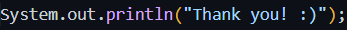

<h1 align="center">Welcome to my GitHub profile! 😎</h1>

 Transforming challenges into innovative solutions 🔥

---

## 👋 About me
Hello, my name is Thomaz! I am a student in the world of technology. I am currently in my 5th semester of Computer Science at the Pontifical Catholic University of Rio Grande do Sul (Portuguese: Pontifícia Universidade Católica do Rio Grande do Sul, PUCRS), one of the most renowned educational institutions in Brazil. Since I was a child, I have always been very interested in topics related to games of all kinds, such as RPGs, FPS, and TPS, for example. With that in mind, I hope to one day have the opportunity to work in the field of computer graphics and game development.

---

## 🧑‍💻 My Technological Skills

  

---

## 🌎 Spoken Languages
- Portuguese
- English
- Spanish (basic)

---

## 🎮 Hobbies & Interests

- 🎨 3D Modeling & Animation  
- 🕹️ Playing RPG, FPS, and TPS games  
- 🚀 Learning about game development  
- 🔭 Stargazing and space exploration  

---

## 🚀 Featured Projects

- 📱 **[Application Subscription Control System](https://github.com/thomazabrantes/TRABALHO-FDS-REAL-OFICIAL/)** 
- 🖥️ **[BVH File Viewer](https://github.com/thomazabrantes/Visualizador-de-Arquivos-BVH)** 
- 📦 **[Longest Stackable Box Sequence](https://github.com/thomazabrantes/Graphs-boxes)**
- 🌆 **[Image Analysis and Processing](https://github.com/thomazabrantes/Processamento-de-Imagens)**

---

## 📜 My Certificates
- **[Introduction to Python](https://www.linkedin.com/posts/thomaz-abrantes-martinelli_eu-recebi-um-novo-certificado-activity-7175994341830606848-MnmI?utm_source=share&utm_medium=member_desktop&rcm=ACoAAEx8I5UBbQFtY9UyphRt1M9DnScTYp7lz4M)**
- **[Python Intermediate](https://www.linkedin.com/posts/thomaz-abrantes-martinelli_eu-recebi-um-novo-certificado-activity-7180370695166574592-jjAX?utm_source=share&utm_medium=member_desktop&rcm=ACoAAEx8I5UBbQFtY9UyphRt1M9DnScTYp7lz4M)**
  
---

## 📩 Contact Me

- 📫 Email: **thomaz.abrantes@edu.pucrs.br** or **thz.martinelli@gmail.com**
- 💼 LinkedIn: [linkedin.com/in/thomaz-abrantes-martinelli](https://www.linkedin.com/in/thomaz-abrantes-martinelli)  

---

  

  

---

