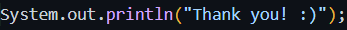

<h1 align="center">Welcome to my GitHub profile! 😎</h1>

 Transforming challenges into innovative solutions 🔥

---

## 👋 About me
Hello, my name is Thomaz! I am a Computer Science student in Pontifical Catholic University of Rio Grande do Sul (PUCRS), with a focus on systems development and web programming. I have a strong interest in turning challenges into efficient solutions by using logic, creativity, and good development practices.

I stand out for my academic dedication, discipline, and constant pursuit of learning. I have knowledge in **Java** (including the **Spring Boot** framework), **Python**, and **C**, as well as ongoing experience in **web development**. I am also familiar with **SQL** and **NoSQL** databases, such as **MongoDB**, and tools like **Power BI**.

I have an aptitude for **solving problems** in a logical and structured way, combining programming and mathematical concepts to build solid solutions. Additionally, I have experience with academic research and writing **scientific articles** (using LaTeX), having taken part in an undergraduate research project, which reinforces my analytical skills and organization.

---

## 🧑‍💻 My Technological Skills

  

---

  
  

---

## 🌎 Spoken Languages
- Portuguese
- English
- Spanish (basic)

---

## 🎮 Hobbies & Interests

- 🎨 3D Modeling & Animation  
- 🕹️ Playing RPG, FPS, and TPS games  
- 🚀 Learning about game development  
- 🔭 Stargazing and space exploration  

---

## 🚀 Featured Projects

- 📱 **[Application Subscription Control System](https://github.com/thomazabrantes/TRABALHO-FDS-REAL-OFICIAL/)** 
- 🖥️ **[BVH File Viewer](https://github.com/thomazabrantes/Visualizador-de-Arquivos-BVH)** 
- 📦 **[Longest Stackable Box Sequence](https://github.com/thomazabrantes/Graphs-boxes)**
- 🌆 **[Image Analysis and Processing](https://github.com/thomazabrantes/Processamento-de-Imagens)**

---

## 📜 My Certificates
- **[Introduction to Python - Sololearn](https://www.linkedin.com/posts/thomaz-abrantes-martinelli_eu-recebi-um-novo-certificado-activity-7175994341830606848-MnmI?utm_source=share&utm_medium=member_desktop&rcm=ACoAAEx8I5UBbQFtY9UyphRt1M9DnScTYp7lz4M)**
- **[Python Intermediate - Sololearn](https://www.linkedin.com/posts/thomaz-abrantes-martinelli_eu-recebi-um-novo-certificado-activity-7180370695166574592-jjAX?utm_source=share&utm_medium=member_desktop&rcm=ACoAAEx8I5UBbQFtY9UyphRt1M9DnScTYp7lz4M)**
- **[English Course at Christ's Hospital School, Horsham, UK - Oxford](https://www.linkedin.com/posts/thomaz-abrantes-martinelli_encontrei-meu-certificado-que-ganhei-em-um-activity-7310043907084447744-DjYa?utm_source=share&utm_medium=member_desktop&rcm=ACoAAEx8I5UBbQFtY9UyphRt1M9DnScTYp7lz4M)**
- **[Character Creation for Games - TIC em Trilhas](https://www.linkedin.com/posts/thomaz-abrantes-martinelli_certificado-cria%C3%A7%C3%A3o-de-personagens-para-games-activity-7311473353880408064-Hleg?utm_source=share&utm_medium=member_desktop&rcm=ACoAAEx8I5UBbQFtY9UyphRt1M9DnScTYp7lz4M)**
- **[2D Game Development - TIC em Trilhas](https://www.linkedin.com/posts/thomaz-abrantes-martinelli_desenvolvimento-de-jogos-em-2d-tic-em-trilhas-activity-7314009355685707777-cZ2_?utm_source=share&utm_medium=member_desktop&rcm=ACoAAEx8I5UBbQFtY9UyphRt1M9DnScTYp7lz4M)**
  
---

## 📩 Contact Me

- 📫 Email: **thomaz.abrantes@edu.pucrs.br** or **thz.martinelli@gmail.com**
- 💼 LinkedIn: [linkedin.com/in/thomaz-abrantes-martinelli](https://www.linkedin.com/in/thomaz-abrantes-martinelli)  

---

  

  

---

